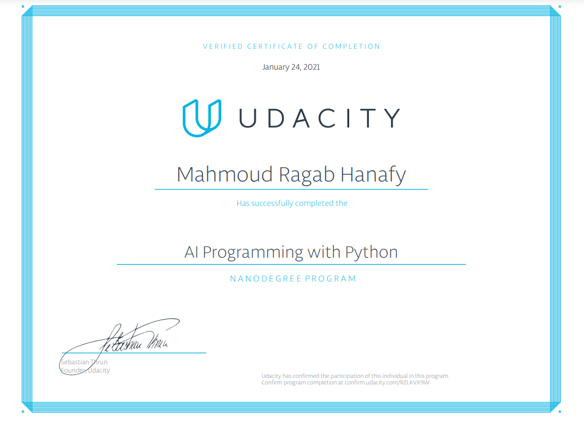

# AI-Programming-with-Python-Nanodegree
This repository contains my submissions for the nanodegree program [AI Programming with Python](https://www.udacity.com/course/ai-programming-python-nanodegree--nd089) offered by [Udacity](https://www.udacity.com/).
 
### Pre-trained Image Classifier to Identify Dog Breeds
----
The first project dealt with using a given image classifier in order to identify dog breeds. The focus was not on training or building the classifier, but on demonstrating the necessary Python skills for setting up a machine learning project, i.e. dealing with the data, looking at different metrics, inspecting results and run times of different classifiers.
 
### Own Image Classifier
----
The second project dealt with building an image classifier almost from scratch. We'll be using this [dataset](https://www.robots.ox.ac.uk/~vgg/data/flowers/102/index.html) of 102 flower categories. Only the very basic foundation of the code was given (i.e. some helper functions and tips). My submission included:
* reading and transforming the data
* choosing a suitable (pretrained) network architecture
* defining a suitable classifier for the chosen architecture
* training the neural network
* evaluating the neural network
* saving and loading checkpoints of the neural network
* illustrating the predictions visually with the corresponding probabilities
 

The first goal of the project was to implement the above described functionality in a Jupyter Notebook. The second goal was to build a command line application allowing the user to:

* choose different network architectures (vgg13, vgg16, alexnet)
* customize the hyperparameters (epochs, learning_rate, hidden units)
* use a GPU for training (if available)
* save and load the model
* use the model to make predictions

### Verified Certification:

